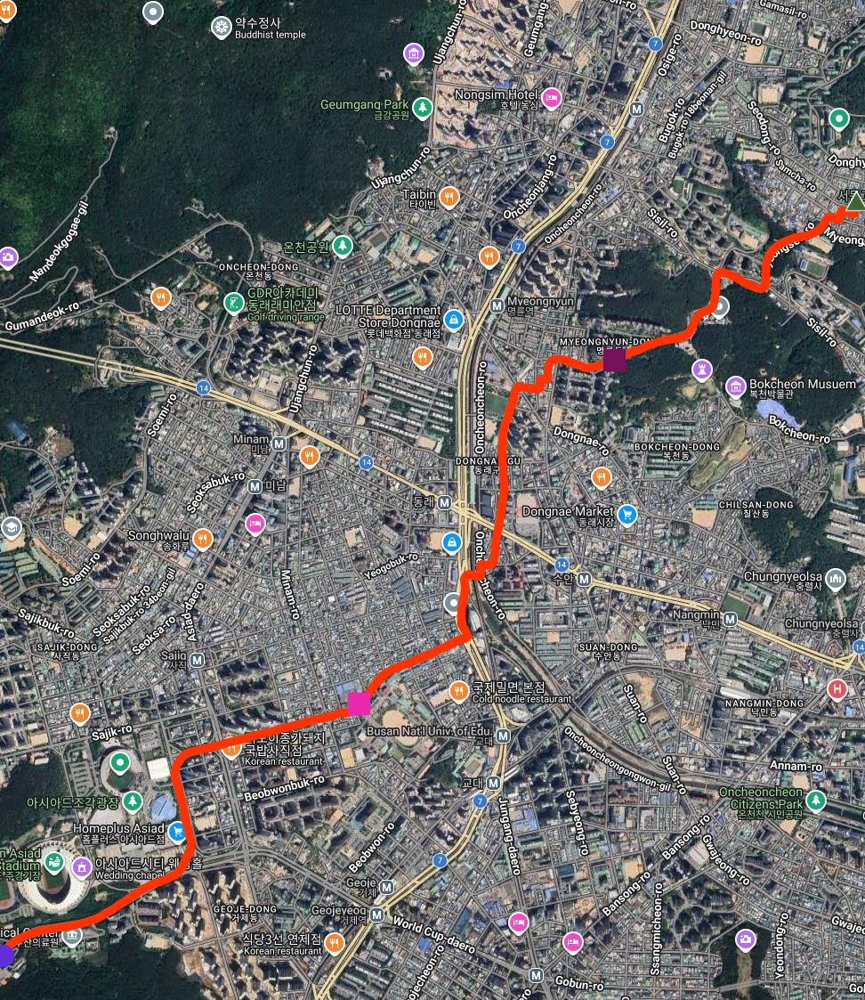
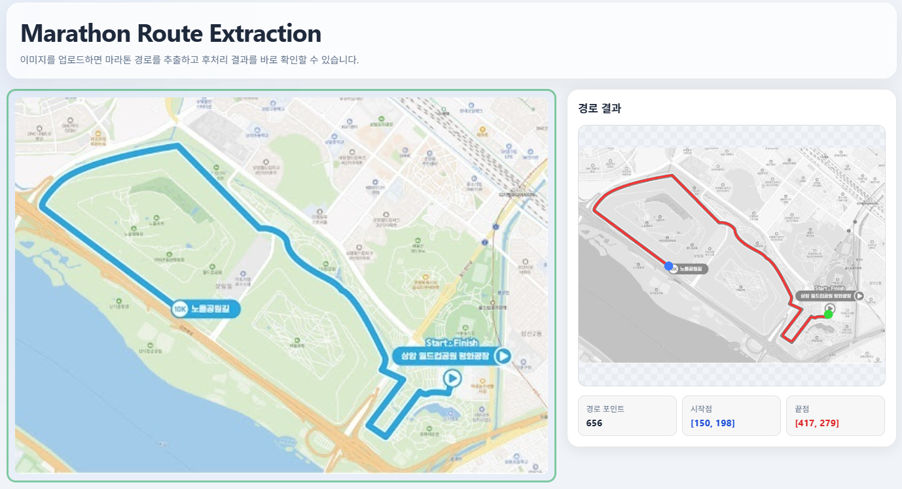

# 🏃 Marathon Route Extraction — Capstone Design Project


> Automatically extract marathon route paths from map images and visualize the extracted route in a demo web app.

---

## 📌 Overview

This project presents an end-to-end pipeline that takes a marathon route map image as input and extracts the route as a pixel path in a demo web app. The pipeline consists of two major components:

- **AI Segmentation (this repo)** — Extracts the route mask from the map image using a custom hybrid model (SegFormerUNet-b2), then refines it into a pixel coordinate list via post-processing.
- **Demo Web App** — Provides a browser UI for image upload, route prediction, post-processing, ordered path extraction, and overlay visualization.
- **[Coordinate Transformation (teammate)](https://github.com/jwonni/Capston-A-man-of-Gyeongsang-do.git)** — Applies OCR-based anchor detection and homography transformation to convert pixel coordinates into GPS coordinates, then exports a GPX file.

### Result Preview

<!-- 원본 이미지 / GT 마스크 / 예측 결과 -->

| Original Image | Ground Truth | Prediction (SegFormerUNet-b2) |
|---|---|---|
|  |  |  |


---

## 🗺️ System Architecture

[](assets/pipeline_overview.png)

The red-highlighted part indicates this repository.

---

## 🧠 Model: SegFormerUNet-b2

A hybrid segmentation model designed specifically for marathon route extraction from map images.

### Why not a standard U-Net?

Standard U-Net uses a CNN-based encoder, which has a limited receptive field 
due to the local nature of convolution operations. Marathon routes span the 
entire image as long, thin linear structures — making global context 
understanding essential. A CNN encoder struggles to capture this long-range 
dependency.

### Why not a standard SegFormer?

SegFormer alone produces coarse segmentation outputs at H/4 resolution, 
which are then upsampled with simple bilinear interpolation. This is 
sufficient for general semantic segmentation but falls short for marathon 
route extraction, where precise boundary recovery along thin, continuous 
path structures is critical.

### So, why SegFormerUNet-b2?

SegFormerUNet-b2 combines the strengths of both architectures to address 
these limitations simultaneously. The Transformer-based MiT-b2 encoder 
captures global context across the entire image via Self-Attention, while 
the U-Net decoder with attention-based skip connections recovers fine-grained 
spatial details and precise path boundaries lost during downsampling.
In short — global understanding from SegFormer, precise restoration from U-Net.

### Architecture

| Component | Role |
|---|---|
| **MiT-b2 Encoder** (Transformer) | Captures global context via Self-Attention across the entire image |
| **ASPP Bridge** | Multi-scale feature extraction with dilated convolutions (rates: 1, 6, 12, 18) |
| **Attention Skip Connection** | Suppresses background noise; passes only refined path features to the decoder |
| **U-Net Decoder** | Restores spatial resolution and reconstructs the route mask pixel by pixel |
| **Deep Supervision** | Auxiliary loss heads at H/16 and H/8 decoder stages; forces boundary and shape information to back-propagate to earlier layers during training |

Architecture Figure:

.png)

---

## 📂 Dataset
Real marathon route map images were collected manually. 
Synthetic route images were additionally generated to address data scarcity and improve model generalization.

| | Details |
|---|---|
| Source | Marathon route map images collected manually |
| Train & Validation | 814 images (Marathon Routes: 214, Synthetic: 600) |
| Test  | 30 images |
| Label | Binary mask (route = white, background = black) |

### Sample Data

| Type | Image | Mask |
|---|---|---|
| Real Marathon Route |  |  |
| Synthetic Route Image |  |  |

---

## 📊 Evaluation Results

Evaluated on 30 test images. **Path F1** is the primary metric, based on skeleton-level comparison between the predicted main path and the GT mask to eliminate thickness bias.

| Model | Path P | Path R | **Path F1** | Dice | IoU |
|---|---|---|---|---|---|
| UNet | 0.868 | 0.030 | 0.058 | 0.546 | 0.429 |
| SegFormer | 0.957 | 0.030 | 0.058 | 0.701 | 0.597 |
| **SegFormerUNet-b2** | **0.998** | **0.039** | **0.075** | **0.843** | **0.749** |

> **Path P (Precision)**: Of the pixels the model predicted as the route, how many are actually on the correct route.  
> **Path R (Recall)**: Of the ground-truth route, how much did the model successfully find.  
> **Path F1**: Harmonic mean of Precision and Recall — the primary performance score.

### Qualitative Comparison

| Input Image | Ground Truth | UNet Prediction | SegFormer-B2 Prediction | SegFormerUNet-b2 Prediction |
|---|---|---|---|---|
|  |  |  |  |  |
 
---

## 🛠️ Installation

```bash
git clone https://github.com/sunuk00/capstone-design.git
cd marathon-path-seg
pip install -r requirements.txt
```

### Key dependencies

```
torch >= 2.0
fastapi
pydantic
uvicorn
scikit-image
opencv-python-headless
matplotlib
```

---

## 🚀 Usage

### Run the demo app

```bash
python app/app.py
```

Then open the web app in your browser:

```text
http://localhost:8010
```

### Demo flow
Before running the demo, ensure that the model weights are downloaded and placed in the `weights/` folder.

You can donwload the weights from the Google Drive Link:  https://drive.google.com/file/d/1ovpREo2kjvndXAEZDQKZnbzXigu-BemO/view?usp=drive_link

You should rename the downloaded files as follows:
- `model_best.pt` -> `segformer_unet_b2_best.pt`

1. Upload a marathon route image in the left panel.
2. The app runs model prediction to produce a route mask.
3. The mask is post-processed into a skeletonized route.
4. The ordered path is extracted automatically.
5. The route overlay and summary are shown in the right panel.

### API endpoints used by the demo

- `POST /api/predict` - model inference from uploaded image
- `POST /api/postprocess` - route mask cleanup and skeletonization
- `POST /api/auto_extract_path` - automatic ordered path extraction

### Demo UI screenshots



---

## 📁 Project Structure

```
marathon-path-seg/
├── app/
│   ├── app.py                    # FastAPI demo server
│   ├── static/index.html         # Demo UI
│   └── src/
│       ├── config.py             # Shared inference / postprocess defaults
│       └── marathon_route_extraction/
│           ├── unet.py           # UNet inference utilities
│           ├── segformer_unet_b2.py
│           ├── postprocess.py    # Mask cleanup and skeletonization
│           └── path_extractor.py # Ordered path extraction
├── configs/
├── data/
├── outputs/
├── weights/
├── requirements.txt
└── README.md
```

---

## 👥 Team & Roles

| Name | Role |
|---|---|
| **ME**| AI segmentation pipeline — data preprocessing, model design & training (UNet / SegFormer / SegFormerUNet-b2), post-processing, demo UI integration |
| Teammate | Coordinate transformation — OCR-based anchor detection (removed from this demo branch) |

---

## 📄 License

This project is for academic purposes as part of the Capstone Design course at Incheon National University (2025-2026).