# 🏃 Marathon Route Extraction — Capstone Design Project


> Automatically extract marathon route paths from map images and convert them into GPX files using a hybrid deep learning segmentation model.

---

## 📌 Overview

This project presents an end-to-end pipeline that takes a marathon route map image as input and outputs a GPX file representing the real-world geographic path. The pipeline consists of two major components:

- **AI Segmentation (this repo)** — Extracts the route mask from the map image using a custom hybrid model (SegFormerUNet-b2), then refines it into a pixel coordinate list via post-processing.
- **[Coordinate Transformation (teammate)](https://github.com/jwonni/Capston-A-man-of-Gyeongsang-do.git)** — Applies OCR-based anchor detection and homography transformation to convert pixel coordinates into GPS coordinates, then exports a GPX file.

### Result Preview

<!-- 원본 이미지 / GT 마스크 / 예측 결과 -->

| Original Image | Ground Truth | Prediction(SegFormerUNet-b2) |
|---|---|---|
| 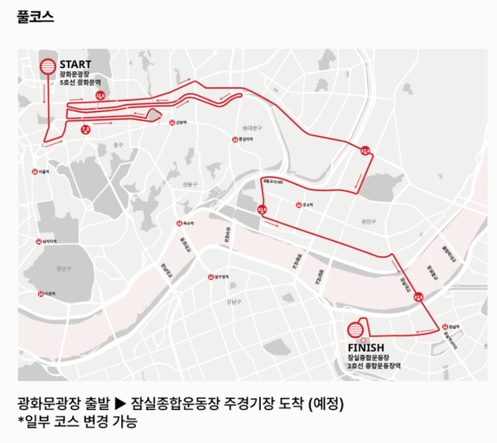 | 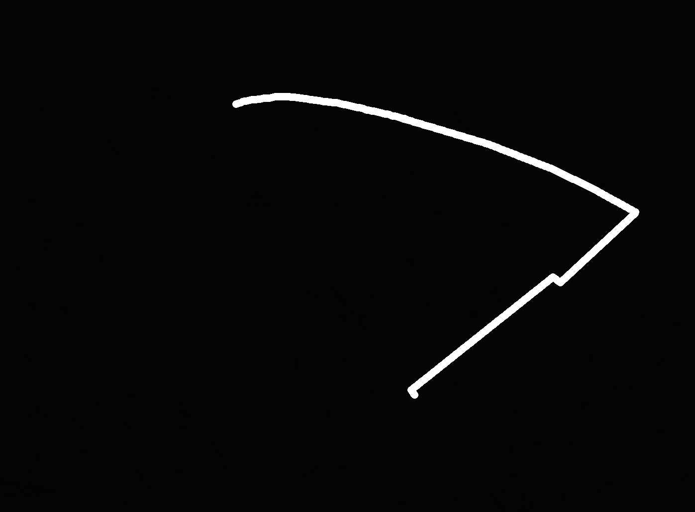 | 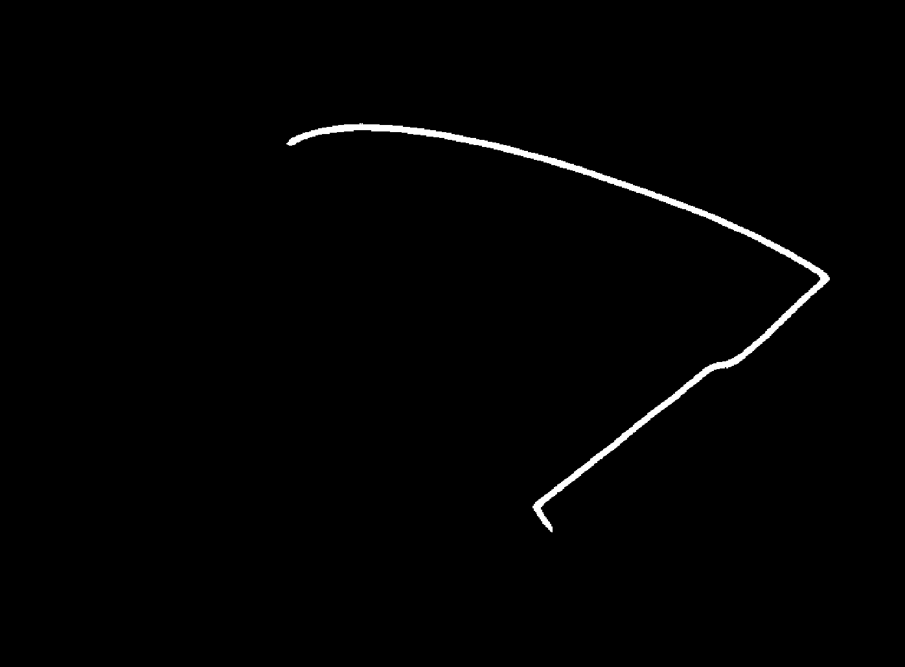 |


---

## 🗺️ System Architecture

[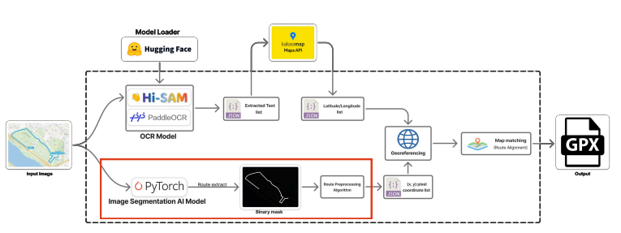](assets/pipeline_overview.png)

The red-highlighted part indicates this repository.

---

## 🧠 Model: SegFormerUNet-b2

A hybrid segmentation model designed specifically for marathon route extraction from map images.

### Why not a standard U-Net?

Standard U-Net uses a CNN-based encoder, which has a limited receptive field due to the local nature of convolution operations. Marathon routes span the entire image as long, thin linear structures — making global context understanding essential. A CNN encoder struggles to capture this long-range dependency.

### Architecture

| Component | Role |
|---|---|
| **MiT-b2 Encoder** (Transformer) | Captures global context via Self-Attention across the entire image |
| **ASPP Bridge** | Multi-scale feature extraction with dilated convolutions (rates: 1, 6, 12, 18) |
| **Attention Skip Connection** | Suppresses background noise; passes only refined path features to the decoder |
| **U-Net Decoder** | Restores spatial resolution and reconstructs the route mask pixel by pixel |
| **Deep Supervision** | Auxiliary loss heads at H/16 and H/8 decoder stages; forces boundary and shape information to back-propagate to earlier layers during training |

Architecture Figure:
.png)

---

## 📂 Dataset
Real marathon route map images were collected manually. 
Synthetic route images were additionally generated to address data scarcity and improve model generalization.

| | Details |
|---|---|
| Source | Marathon route map images collected manually |
| Train | 800+ images |
| Test  | 30 images |
| Label | Binary mask (route = white, background = black) |

### Sample Data

| Type | Image | Mask |
|---|---|---|
| Real Marathon Route | 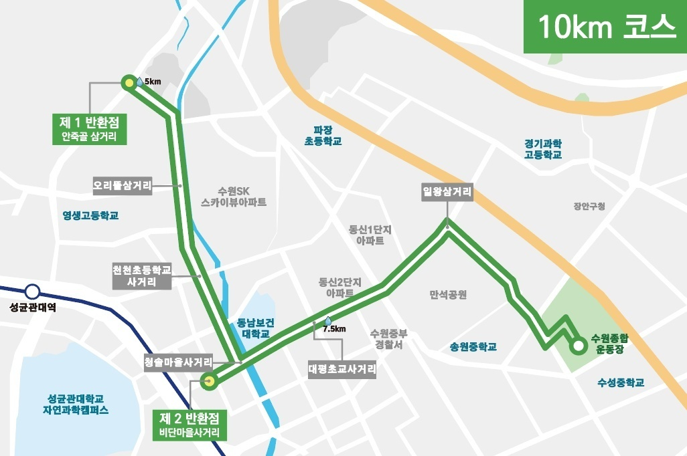 | 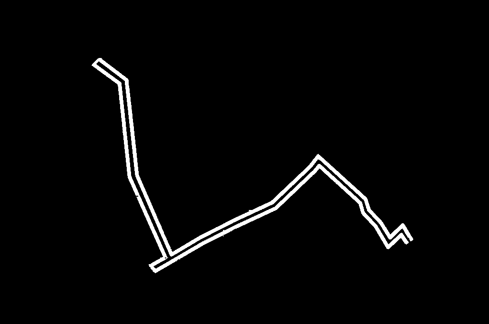 |
| Synthetic Route Image |  | 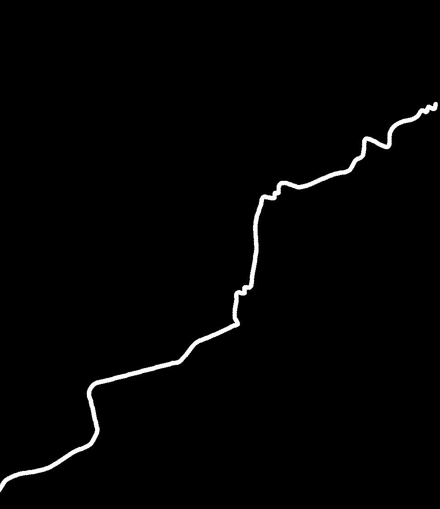 |


## 📊 Evaluation Results

Evaluated on 30 test images. **Path F1** is the primary metric, based on skeleton-level comparison between the predicted main path and the GT mask to eliminate thickness bias.

| Model | Path P | Path R | **Path F1** | Dice | IoU |
|---|---|---|---|---|---|
| UNet | 0.868 | 0.030 | 0.058 | 0.546 | 0.429 |
| SegFormer | 0.957 | 0.030 | 0.058 | 0.701 | 0.597 |
| **SegFormerUNet-b2** | **0.998** | **0.039** | **0.075** | **0.843** | **0.749** |

> **Path P (Precision)**: Of the pixels the model predicted as the route, how many are actually on the correct route.  
> **Path R (Recall)**: Of the ground-truth route, how much did the model successfully find.  
> **Path F1**: Harmonic mean of Precision and Recall — the primary performance score.

### Qualitative Comparison: `test002`

| Input Image | Ground Truth | UNet Prediction | SegFormer-B2 Prediction | SegFormerUNet-b2 Prediction |
|---|---|---|---|---|
| 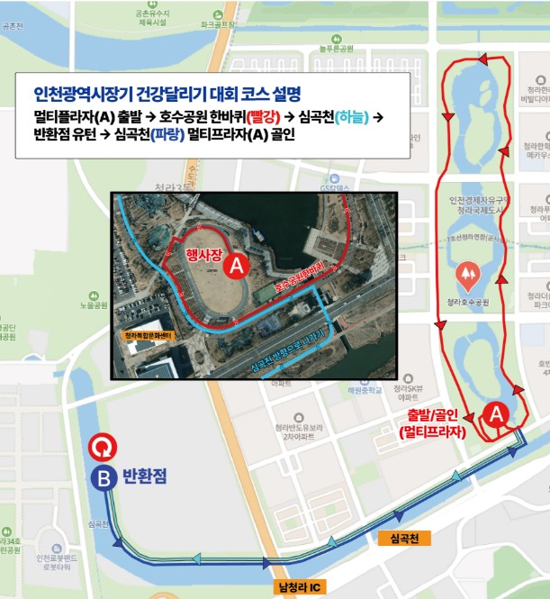 | 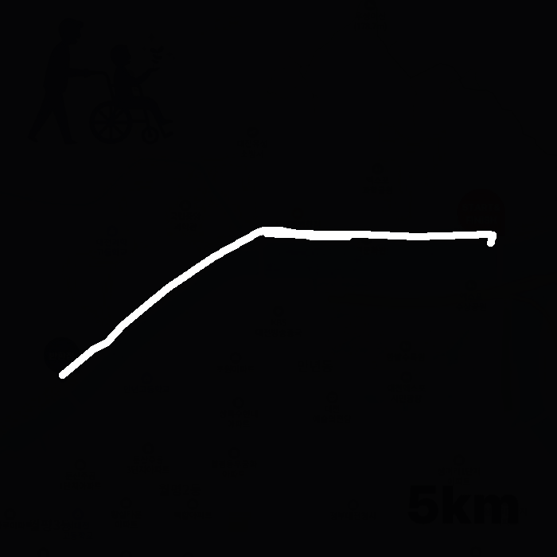 | 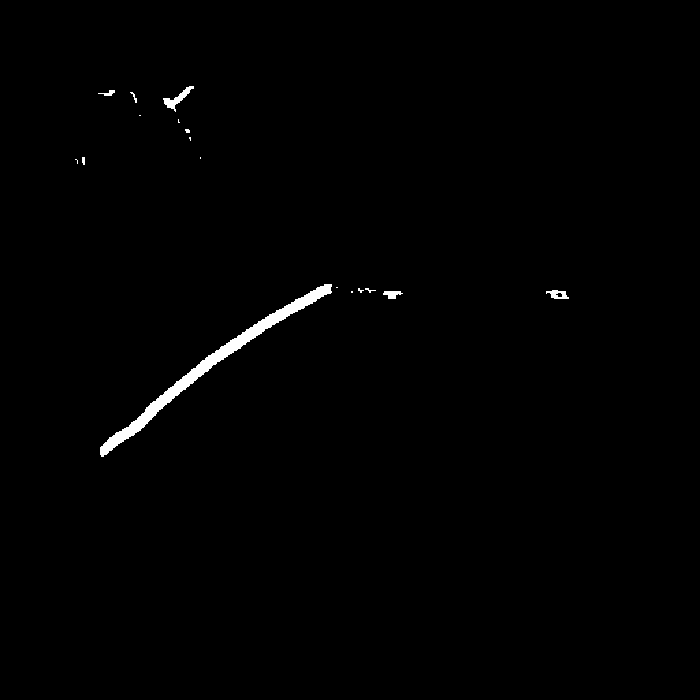 | 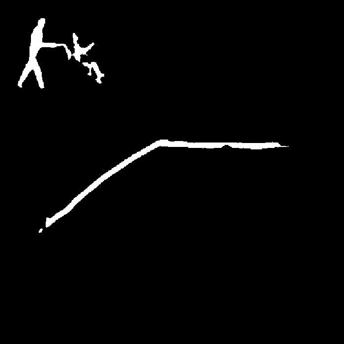 | 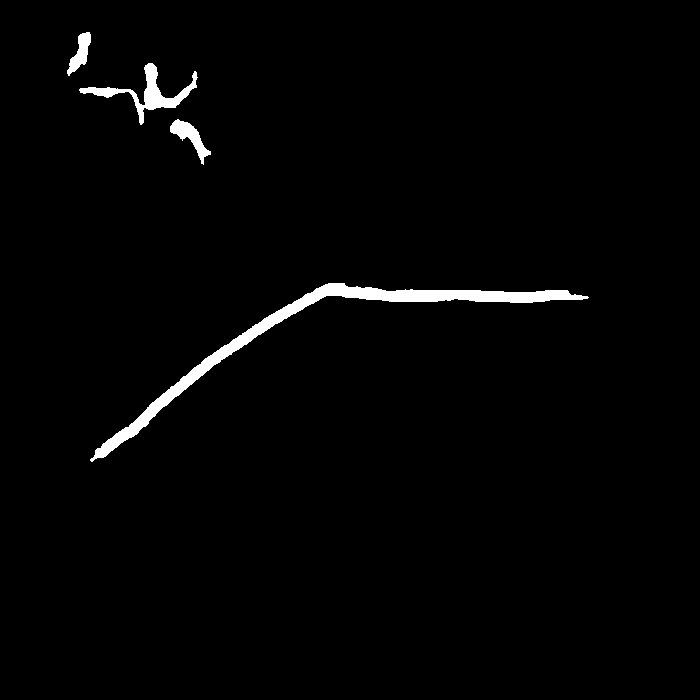 |
 
---

## 🛠️ Installation

```bash
git clone https://github.com/sunuk00/capstone-design.git
cd capstone-design
pip install -r requirements.txt
```

**Key dependencies**
```
torch >= 2.0
transformers
albumentations
scikit-image
opencv-python
matplotlib
tqdm
```

---

## 🚀 Usage

### Run Evaluation

```bash
python src/evaluation.py \
  --unet_weights      weights/unet_best.pt \
  --segformer_weights weights/segformer_best.pt \
  --sfunet_weights    weights/segformer_unet_b2_best.pt
```

Evaluate a single model:
```bash
python src/evaluation.py --sfunet_weights weights/segformer_unet_b2_best.pt
```

### Output

```
eval_results/
├── eval_results.csv       # Per-image and average metrics
├── paper_table.png        # Publication-style result table
└── viz/
    ├── UNet/
    ├── SegFormer/
    └── SegFormerUNet-b2/  # Prediction overlays per image
```

---

## 📁 Project Structure

```
capstone-design/
├── src/
│   ├── models/
│   │   ├── unet.py
│   │   ├── segformer.py
│   │   └── segformer_unet.py      # SegFormerUNet-b2
│   ├── evaluation.py              # Evaluation pipeline
│   └── postprocess.py             # Post-processing pipeline
├── configs/                       # Training / inference YAML configs
├── data/
│   └── test/
│       ├── images/                # Test images
│       └── masks/                 # Ground truth masks
├── outputs/                       # Experiment outputs and checkpoints
│   ├── unet/
│   │   └── exp*/                  # e.g. model_best.pt, model_last.pt
│   ├── segformer/
│   │   └── exp*/
│   └── segformer-unet-b2/
│       ├── exp*/                  # model_best.pt, training_log.json
│       └── exp*/predictions/      # predicted masks + prediction_log.json
├── eval_results/                  # Evaluation outputs and visualizations
│   ├── eval_results.csv
│   └── viz/
│       ├── UNet/
│       ├── SegFormer/
│       └── SegFormerUNet-b2/
├── requirements.txt
└── README.md
```

---

## 👥 Team & Roles

| Name | Role |
|---|---|
| **ME**| AI pipeline — data preprocessing, model design & training (UNet / SegFormer / SegFormerUNet-b2), post-processing, evaluation |
| Teammate | Coordinate transformation — OCR-based anchor detection (Hi-SAM + PaddleOCR), homography matrix computation, GPX export |

---

## 📝 Related Posts

- [U-Net Architecture Review](https://sunuk00.github.io/Papers/2026-03-23-UNet.html) — Analysis of U-Net's structural limitations for linear path segmentation
- [Capstone Final Report](https://sunuk00.github.io/Projects/Capstone/) - Comprehensive documentation of the project, including methodology, results, and future work

---

## 📄 License

This project is for academic purposes as part of the Capstone Design course at Incheon National University (2025-2026).